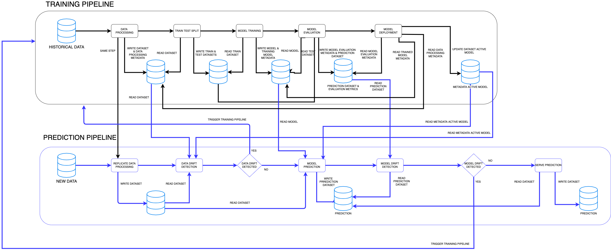

# DDS-ML-PIPELINE



### Business Requirements
The goal of this project is to perform training and prediction of the carbons emission in Italy.

### Getting Started

#### Environment
Create **conda** environment, from terminal run:
```
conda create -n ml-pipeline python=3.8
```

then, activate the env:
```
conda activate ml-pipeline
```


#### Run pipeline
```
python pipeline_orchestrator.py --staging_level_run_type=DEV --pipeline_type_name=TRAINING_PIPELINE
```

#### MLOps steps
On each step, defines:
* `unit tests`, that are responsible for testing single function
* `integration tests`, determines if the steps return the expected outcome and combine them to test if the workflow run as expected.

Defines the following pipelines:
* `training_pipeline`:
    * `data processing`, performs feature pre-processing and data manipulation
        * `input`
            * `raw data`
        * `output`
            * `data processed`
    * `train test split`, splits up the pre-processed dataset into train and test
        * `input`
            * `data processed & data processing metadata`
        * `output`
            * `train & test datasets`
    * `model training`, performs training of the models
        * `input`
            * `train dataset`
        * `output`
            * `trained model & trained model metadata`
    * `model evaluation`, calculates performance metrics on the models and performs predictions on test dataset
        * `input`
            * `test dataset`
            * `trained model`
        * `output`
            * `prediction dataset & model evaluation metadata`
    * `model deployment`, deploy the model on PROD
        * `input`
            * `data processing metadata`
            * `model trained metadata`
            * `model evaluation metadata`
        * `output`
            * `active model dataset`

* `prediction_pipeline`:
      * `data processing`, performs the feature_engineering step from the training_pipeline (change input and output path for reading/writing data)
      * `data drift detection`, detects if there's some data drift between current prediction data and those data used for training the model. If there's some data drift, then re-train the model and follow all the steps from the training_pipeline to create a new version of the models.
      * `model_prediction`, runs this step if there's no data-drift and store the predicted data.
      * `model drift detection`, this steps checks if there's model drift in between predicted values and actual values (from training dataset). It compares the distribution of prediction dataset and training dataset and measure if theres' some significant difference


### ML Structure
```
│
├── pipeline_orchestrator.py
├── notebooks/
├── tests/
|     ├── unit_tests/
|     └── integration_tests/
├── config/
|     ├── config.yaml
|     └── logging_config.yaml
└── src/
      ├── training_pipeline.py
      ├── prediction_pipeline.py
      ├── data_processing/
      |     ├── src/
      |     |    └── sql_queries/
      |     └── data_processing.py
      ├── train_test_split/
      |     ├── src/
      |     |    └── sql_queries/
      |     └── train_test_split.py        
      ├── model_training/
      |     ├── src/
      |     |    └── sql_queries/
      |     └── model_training.py   
      ├── model_evaluation/
      |      ├── src/
      |      |    └── sql_queries/
      |      └── model_evaluation.py  
      ├── data_drift_detection/
      |      ├── src/
      |      |    └── sql_queries/
      |      └── data_drift_detection.py 
      └── model_prediction/
            ├── src/
            |    └── sql_queries/
            └── model_prediction.py    
   
```  
### Continuous Integration (CI)
Continuous integration (CI) is the practice of automating the integration of code changes from multiple contributors into a single software project.
* recreate the same environment in production
* run tests

Include **rule** on Github:
* avoid pushing directly to `main` branch
* forcing pull request before merging with `main` branch 
* before merging, wait until all checks have passed

From terminal, run the following command:
```
python -m pytest -r tests/unit_tests/
```


### OOP vs Procedural Programming
All those steps included in this repo are considered as data structures, so they expose their argument.
The training_pipeline decide which methods of which step should be run, so it orchestrates all those methods needed to accomplish the goal.
The pipeline_orchestrator module handle with the right pipeline to run.

### References
* [Model Drift Detection](https://towardsdatascience.com/mlops-model-monitoring-prior-probability-shift-f64abfa03d9a)
* [Model Monitoring](https://towardsdatascience.com/mlops-model-monitoring-101-46de6a578e03)
* [ML Pipeline](https://towardsdatascience.com/mlops-level-1-continuous-training-b2a633e27d47)
* [Continuous Training](https://omdena.com/blog/continuous-training-machine-learning-models/)
* [ML Pipeline Monitoring](https://neptune.ai/blog/how-to-monitor-your-models-in-production-guide)
* [Monitor ML in production](https://towardsdatascience.com/monitoring-machine-learning-models-in-production-how-to-track-data-quality-and-integrity-391435c8a299)
* [Monitor ML in production](https://towardsdatascience.com/essential-guide-to-machine-learning-model-monitoring-in-production-2fbb36985108)
* [CI for ML](https://ploomber.io/blog/ci-for-ds/)
* [CI with GitHub Actions](https://towardsdev.com/build-a-ci-pipeline-with-github-actions-for-python-project-cdc7852fbed3)


### Author
@fabiobarbazza
